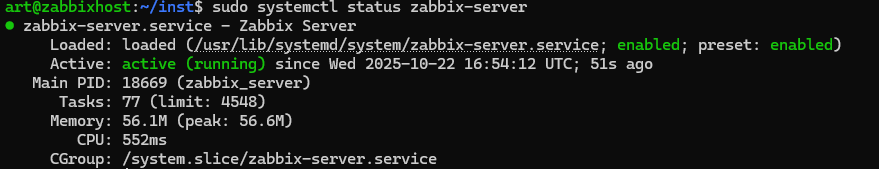
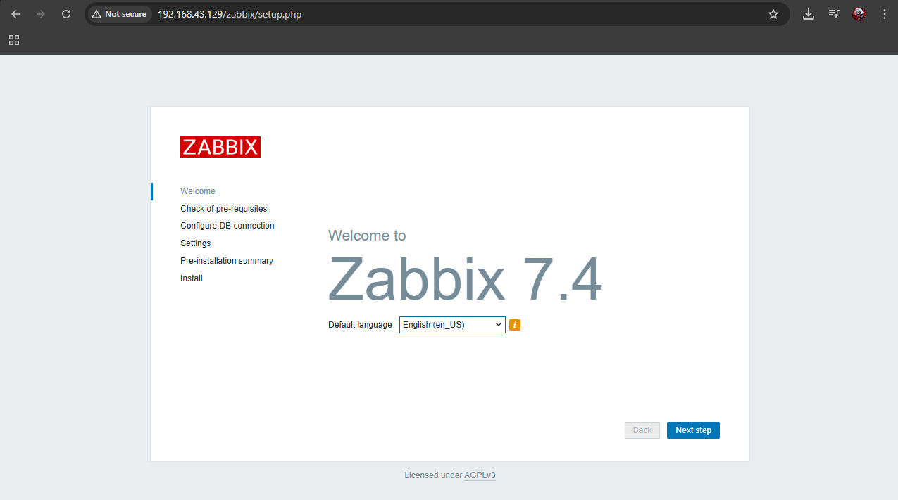
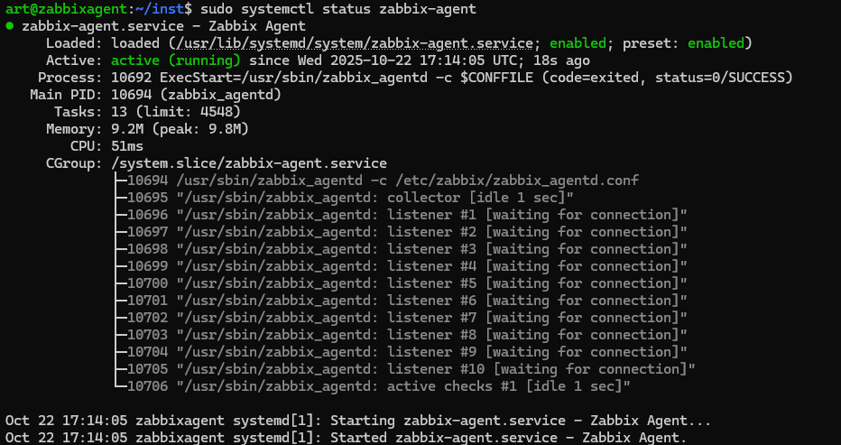
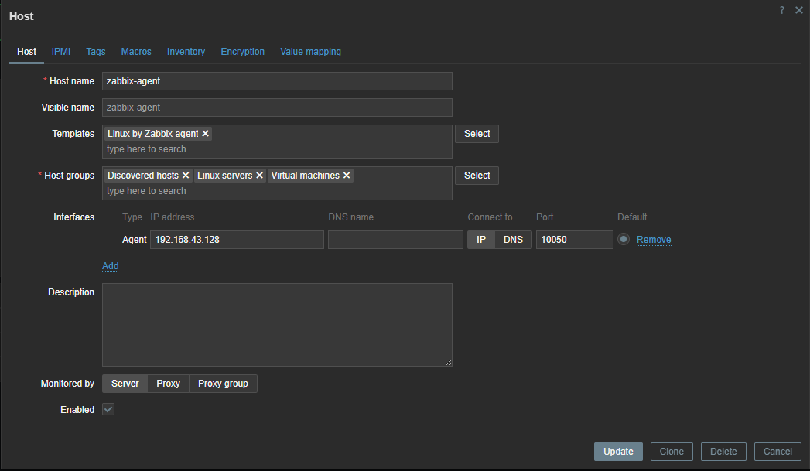
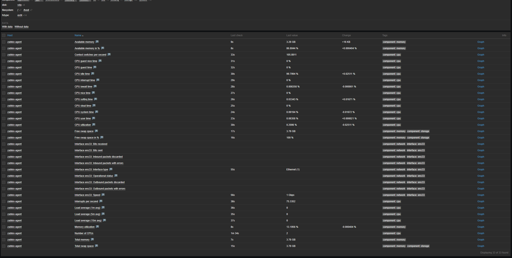
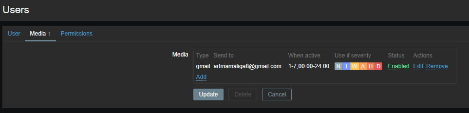
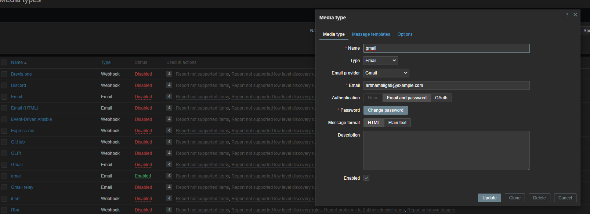
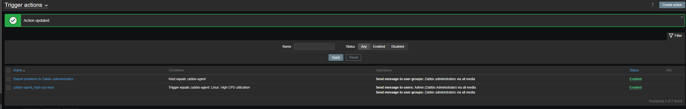
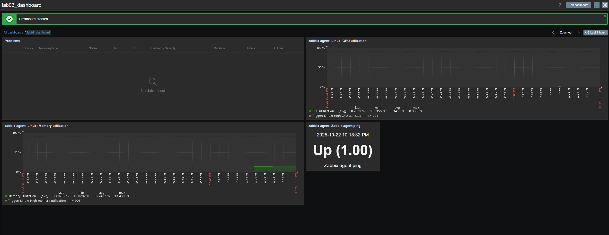

# Лабораторная работа №3: Мониторинг ИТ‑инфраструктуры с использованием Zabbix

Ниже — мой отчёт о выполнении лабораторной работы по развертыванию Zabbix, подключению агента и настройке базового мониторинга с оповещениями и дашбордом. Я постарался оставить только нужные шаги и добавить пояснения, чтобы по тексту было легко идти и повторять.

## Цель

Разобраться с системой мониторинга Zabbix и применить её для наблюдения за состоянием серверов и сервисов: установка, сбор метрик, оповещения и персональная панель.

## Что использовалось

- Две ВМ (Ubuntu Server 22.04):
  - `zabbix_host` — сервер Zabbix;
  - `zabbix_agent` — контролируемая машина.
- Сеть с доступом в Интернет.
- Программные компоненты: Zabbix Server + MySQL + Apache, Zabbix Agent.

## Кратко о проделанном

Я развернул сервер Zabbix, подключил к нему агент на второй машине, добавил хост в интерфейсе, посмотрел ключевые метрики, настроил почтовые оповещения и собрал простой дашборд для быстрого обзора.

## 1. Установка и первичная настройка Zabbix Server

Ставлю серверные компоненты на `zabbix_host` и подключаю репозиторий Zabbix:

```
sudo apt update
sudo apt install mysql-server apache2 php php-mysql libapache2-mod-php
wget https://repo.zabbix.com/zabbix/7.0/ubuntu/pool/main/z/zabbix-release/zabbix-release_7.0-1+ubuntu22.04_all.deb
sudo dpkg -i zabbix-release_7.0-1+ubuntu22.04_all.deb
sudo apt update
sudo apt install -y zabbix-server-mysql zabbix-frontend-php zabbix-apache-conf zabbix-agent
```

Делаю базу данных и пользователя для Zabbix, затем импортирую схему:

```
sudo mysql -e "CREATE DATABASE zabbix CHARACTER SET utf8mb4 COLLATE utf8mb4_bin;"
sudo mysql -e "CREATE USER 'zabbix'@'localhost' IDENTIFIED BY 'zabbix';"
sudo mysql -e "GRANT ALL PRIVILEGES ON zabbix.* TO 'zabbix'@'localhost';"
zcat /usr/share/zabbix-sql-scripts/mysql/server.sql.gz | mysql -uzabbix -pzabbix zabbix
```

В конфиге указываю пароль БД и запускаю службы:

```
sudo nano /etc/zabbix/zabbix_server.conf
DBPassword=zabbix

sudo systemctl enable --now zabbix-server zabbix-agent apache2
```

Проверяю, что сервер поднялся и веб‑интерфейс доступен:





## 2. Установка Zabbix Agent на контролируемую машину

На `zabbix_agent` ставлю агент и настраиваю подключение к серверу:

```
sudo apt update
wget https://repo.zabbix.com/zabbix/7.0/ubuntu/pool/main/z/zabbix-release/zabbix-release_7.0-1+ubuntu22.04_all.deb
sudo dpkg -i zabbix-release_7.0-1+ubuntu22.04_all.deb
sudo apt update
sudo apt install -y zabbix-agent

sudo nano /etc/zabbix/zabbix_agentd.conf
Server=<IP_zabbix_host>
ServerActive=<IP_zabbix_host>
Hostname=zabbix-agent

sudo systemctl enable --now zabbix-agent
```

Проверяю, что агент работает и подключается:



## 3. Добавление хоста в веб‑интерфейсе

В веб‑интерфейсе: Configuration - Hosts - Create host. Заполняю поля:

- Host name: `zabbix-agent`;
- IP: адрес второй ВМ;
- Template: `Linux by Zabbix agent`.

Сохраняю и убеждаюсь, что хост в статусе «Available» (зелёный индикатор):



## 4. Просмотр собираемых метрик

Открываю Monitoring - Latest data и проверяю ключевые показатели: загрузку CPU, доступную память и сетевой трафик. Всё обновляется и выглядит корректно:



## 5. Настройка почтовых оповещений

Включаю готовый Media type для Gmail: Administration - Media types - Gmail - Enable. Заполняю SMTP `smtp.gmail.com`, порт `587`, добавляю учётные данные.

Дальше: Users - Admin - Media — добавляю свой адрес почты. В Configuration - Actions активирую «Report problems to Zabbix administrators», чтобы события приходили на email.








## 6. Персональная панель мониторинга (Dashboard)

Создаю дашборд: Monitoring - Dashboards - Create dashboard. Я назвал его `My Dashboard` и добавил несколько виджетов для быстрого обзора состояния хоста:

- Problems (активные события);
- Graph (CPU) — загрузка процессора;
- Graph (Memory) — использование памяти;
- Item value (Ping) — пинг;
- Data overview — сводка по хосту.



## Итоги

- Развернул Zabbix Server и подключил Zabbix Agent.
- Добавил хост, убедился в корректном сборе метрик.
- Настроил email‑оповещения о проблемах.
- Собрал наглядный дашборд для повседневного просмотра.

## Ответы на контрольные вопросы

- Компоненты Zabbix: Server, Agent, Proxy, Database, Frontend.
- Взаимодействие сервера и агента: сервер может опрашивать агент (passive), либо агент сам отправляет данные (active).
- Триггеры: правила, по которым фиксируются проблемы и запускаются уведомления (например, «CPU > 80% в течение 5 минут»).


